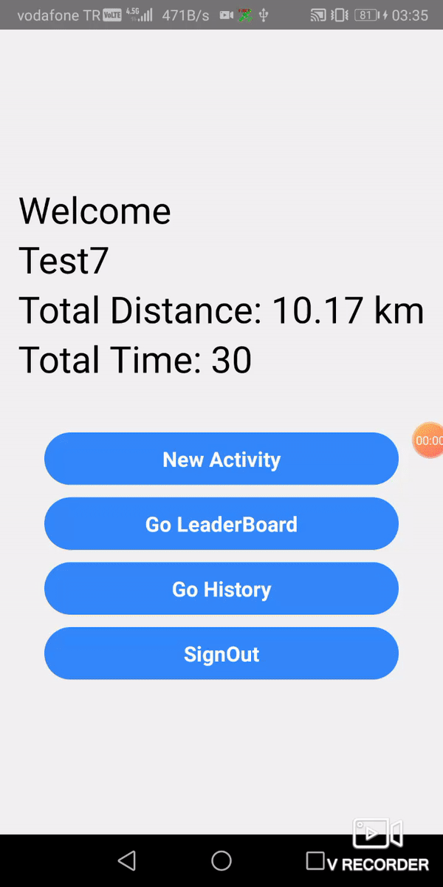

# Running Tracker React Native App

  

  

# Setup

## Installing packages:

- [Install React Native](https://reactnative.dev/docs/environment-setup)

- Create a folder then `git clone <My Repository Adress>` to clone github repository

- run `yarn` for installing all the dependencies

- for **macOS** users use `pod install` in your ios directory

# Tools & Resources

- [React Navigation](https://reactnavigation.org/) for page hierarchy
- [React Native Redux] for context,
- [React Native Formik and Yup] for formValues
- [React Native Firebase] for database
- [React Native Modal](https://www.npmjs.com/package/react-native-modal) for better modals
- [Axios](https://www.npmjs.com/package/axios) for fetch requests
- [Weather API] for current weather
- [React Native Maps and Gealocation] for maps

#WorkFlow

In this app I made a running tracker and data saver for users. You can sign up with email and username. Then login to app. When you login, Home screen will be open. In this screen I call firebase with userId to get all user info. You can see some informations about user. Also there is a some buttons to do new activity, looking activity history and leaderboard. When you open the new activity screen I get the user current location and weather from WeatherApi. 
After datas came, user see the map and his/her current location in the map. Also user can see temperature and humidity datas. When user click the start button the timer start and get current location will be saved at regular intervals and showed in the map. Also users can see speed and total distance values. In line chart users can see how far they have traveled at regular intervals. When they clickmthe finish button their datas will save in firebase. Also users can share their activity in social media. 
They can see their old activities in history screen and they can see who are the best runners in the other users at leaderboard screen. This data come from firebase and order by total distances. 
# Contributors

<a href="https://github.com/salik-a">

<b>Alper Salik
</b>

</a>

